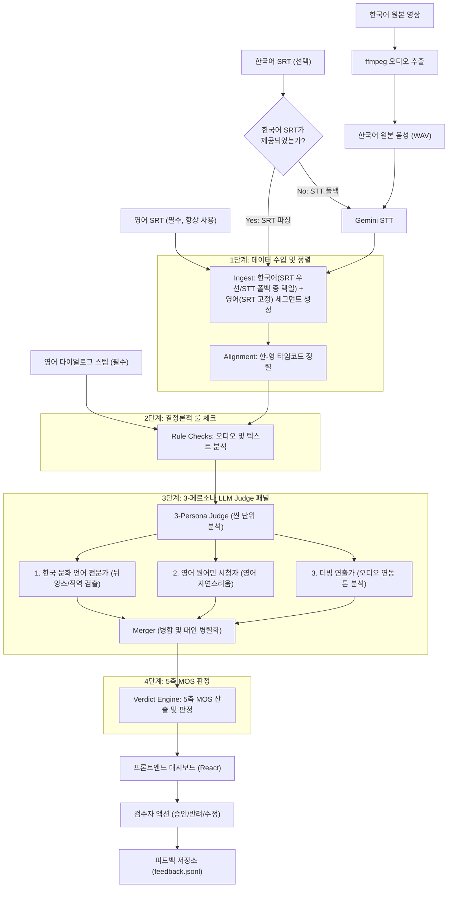
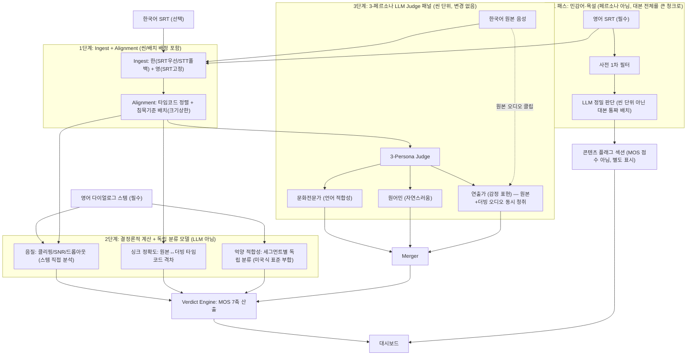
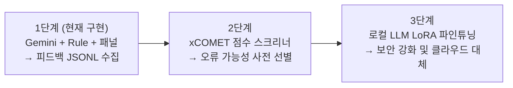

# AETHER // AI 더빙 Quality Control Suite 프로젝트 개요

AETHER는 한국 영화의 영어 AI 더빙 결과물의 품질을 종합적으로 검수(QC, Quality Control)하기 위한 사내 실무 도구입니다. 한국어 원본과 영어 더빙 완성본(SRT 자막 및 다이얼로그 스템 오디오)을 대조하여 직역 오류, 문화적 뉘앙스 손실, 발화 속도 및 싱크 오버플로, 오디오 노이즈 등의 음질 이슈를 시스템적으로 검출하고 5축 MOS 스코어카드를 기준으로 최종 통과/조건부 통과/반려 판정을 내립니다.

이 문서는 AETHER 프로젝트의 전체적인 설계 아키텍처, 주요 데이터 규약, 컴포넌트 구조, 그리고 향후 로드맵을 한눈에 파악할 수 있도록 돕습니다.

> **구현 상태**: 이 문서의 내용(5축 MOS)은 **현재 구현·운영 중인 버전** 기준입니다.
> 오디오/음성 차원을 확장한 다음 버전(7축 MOS) 설계는 완료되었으나 **아직 구현 전**이며,
> §6 "다음 버전(v2) 미리보기"와 [`2026-07-15-dubbing-qc-v2-audio-redesign.md`](docs/superpowers/specs/2026-07-15-dubbing-qc-v2-audio-redesign.md)를 참고하세요.

---

## 📌 주요 특징 (Key Characteristics)
1. **실제 더빙 완성본 검수**: 기존 AI 번역 툴처럼 스스로 번역하고 검증하는 방식이 아닌, 외부에서 최종 제작된 **더빙 결과물(영어 SRT + 다이얼로그 오디오 스템)**을 입력받아 한국어 원본과 교차 검증합니다.
2. **하이브리드 텍스트 수집 (SRT 우선, STT 폴백)**: 사람이 확정한 SRT 자막이 제공될 경우 이를 우선 사용해 정확도를 높이고 비용을 절감하며, 한국어 SRT가 없는 경우에만 AI STT를 통해 음성에서 텍스트를 추출하는 폴백 경로를 탑재하고 있습니다.
3. **3-페르소나 LLM Judge 패널**: 영화 씬(Scene) 단위로 컨텍스트를 구성하여 3가지 독립된 관점(한국 문화 전문가, 영어 원어민 시청자, 더빙 연출가)에서 분석하고, 병합기(Merger)를 통해 의견을 합쳐 대안 수정안과 신뢰도를 도출합니다.
4. **5축 MOS 스코어카드**: 사내 표준 평가 체계인 **음질, 감정 표현, 싱크 정확도, 자연스러움, 언어 적합성**의 5가지 축을 기준으로 MOS(1~5점) 점수를 산출합니다.
5. **검수자 피드백 루프**: AI 판정은 가판정이며, 검수자의 최종 승인/반려/직접 수정 액션은 JSONL 피드백 저장소에 기록되어 향후 로컬 LLM 미세조정(LoRA)용 학습 데이터셋으로 전환됩니다.
6. **보안 지향 설계**: `GEMINI_API_KEY` 환경변수가 설정되지 않은 경우 목(Mock) 데이터로 자동 폴백되지 않고 즉시 503 에러로 처리를 거부하여 실제 오탐 및 검수 품질 오염을 원천 차단합니다.

---

## 🏗️ 시스템 아키텍처 및 데이터 흐름



---

## 📂 프로젝트 폴더 구조 및 파일 역할

```text
dubbing_qc/
├── start.sh                       # 백엔드 & 프론트엔드 동시 실행 스크립트
├── README.md                      # 간편 실행 및 로컬 환경 설치 가이드
├── PROJECT_OVERVIEW.md            # [본 문서] 아키텍처 및 큰 틀을 설명하는 가이드
├── docs/superpowers/
│   ├── specs/
│   │   └── 2026-07-14-dubbing-qc-redesign-design.md  # 설계 스펙 및 요구사항 정의서
│   └── plans/
│       └── 2026-07-14-dubbing-qc-pipeline.md         # 태스크별 구현 상세 계획서
│
├── backend/
│   ├── app/
│   │   ├── main.py                # FastAPI 엔드포인트 구현 (업로드, 실행, 피드백, 재판정)
│   │   ├── schemas.py             # Pydantic 데이터 모델 (데이터 계약 규약 정의)
│   │   ├── qc_config.yaml         # MOS 임계값, 5축 감점 가중치 설정 파일
│   │   ├── core/
│   │   │   ├── pipeline.py        # QC 파이프라인의 오케스트레이션 엔진
│   │   │   ├── ingest.py          # SRT 파서 및 Gemini STT 연동 폴백기
│   │   │   ├── alignment.py       # 한국어-영어 세그먼트 간의 타임코드 정렬 알고리즘
│   │   │   ├── rule_checks.py     # 번역 누락, 속도 초과, 음질(SNR, Clipping) 등 결정론적 검증기
│   │   │   ├── judge_panel.py     # 3-페르소나 LLM Judge 패널 호출 및 병합기
│   │   │   ├── verdict.py         # 5축 MOS 계산 및 최종 통과/반려 판정 엔진
│   │   │   ├── context.py         # (보존) 시각 맥락 레이어 연동 엔진 (향후 활성화)
│   │   │   └── voice_qc.py        # (보존) 음색 일관성 검사 엔진 (향후 활성화)
│   │   ├── providers/
│   │   │   ├── base.py            # ModelProvider 추상 클래스 및 의존성 팩토리
│   │   │   ├── gemini.py          # Gemini API 기반의 비동기 트랜스크립션 및 판단 구현체
│   │   │   └── mock.py            # 테스트 스위트 구동을 위한 모크 프로바이더
│   │   ├── knowledge/
│   │   │   ├── loader.py          # 지식베이스 YAML 로더
│   │   │   ├── honorifics.yaml    # 호칭 번역 지식베이스 (형/누나/선배/부장 등)
│   │   │   └── idioms.yaml        # 한국어 관용구 번역 지식베이스 (눈치/어이없네 등)
│   │   └── feedback/
│   │       └── store.py           # 검수 피드백 데이터를 JSONL 파일에 Append 기록하는 영속성 계층
│   ├── tests/                     # pytest 테스트 패키지
│   └── requirements.txt           # 백엔드 Python 패키지 의존성 파일
│
└── frontend/
    ├── index.html
    └── src/
        ├── main.jsx
        ├── App.jsx                 # 3-탭 화면 구조 및 검수(Review) 뷰 조율
        ├── App.css                 # 다크 테마 디자인 시스템 스타일시트
        ├── api.js                  # 백엔드 API와의 비동기 통신 클라이언트
        └── views/
            ├── ProjectView.jsx     # 파일 업로드 컨트롤러 및 파이프라인 진행률 대시보드
            └── ReportView.jsx      # 5축 MOS 스코어카드 시각화 및 내보내기 리포트 뷰
```

---

## 🛠️ 백엔드 파이프라인 핵심 컴포넌트 상세

### 1. Ingest & Alignment (수입 및 정렬)
- **[ingest.py](file:///Users/choisoyeong/Desktop/vscode/dubbing_qc/backend/app/core/ingest.py)**: 영어 SRT는 필수적으로 파싱하고, 한국어는 SRT 파일이 들어오면 우선 파싱하여 텍스트 소스를 로드합니다. 한국어 SRT가 지정되지 않은 경우, 원본 비디오에서 ffmpeg를 통해 추출한 한국어 오디오에 대해 Gemini STT API(`transcribe`)를 호출하여 타임코드가 부여된 텍스트 세그먼트를 생성합니다.
- **[alignment.py](file:///Users/choisoyeong/Desktop/vscode/dubbing_qc/backend/app/core/alignment.py)**: 타임코드의 중첩도(overlap ratio) 및 시간적 근접성을 바탕으로 한국어 세그먼트와 영어 더빙 세그먼트의 짝을 맞춰 `AlignedPair` 리스트를 구성합니다. 정렬 신뢰도가 지나치게 낮거나 매칭되지 않고 누락된 세그먼트는 그 자체로 검출 건(Finding)이 됩니다.

### 2. Deterministic Rule Checks (결정론적 룰 체크)
- **[rule_checks.py](file:///Users/choisoyeong/Desktop/vscode/dubbing_qc/backend/app/core/rule_checks.py)**: LLM을 타지 않는 빠르고 가벼운 결정론적/휴리스틱 필터입니다.
  - **텍스트 체크**: 영어 대사의 글자 수와 발화 시간에 따른 발화속도 초과(Speaking Rate, 지나치게 빠름), 싱크 오버플로(자막 노출 시간 초과) 및 한국어에 매칭되는 영어 대사 누락 등을 잡아냅니다.
  - **오디오 음질 체크**: 영어 다이얼로그 오디오 스템 WAV 파일의 바이너리를 읽어 드롭아웃(갑작스러운 무음 구간), 클리핑(오디오 일그러짐, Clipping), 낮은 신호 대 잡음비(SNR, 잡음 과다)를 직접 감지합니다.
  - **자막-음성 일치 검증**: 다이얼로그 오디오 스템에서 샘플링한 구간을 STT로 받아 적은 뒤, 영어 SRT의 자막 텍스트와 대조하여 성우가 대본과 다르게 연기한 구역을 발견합니다.

### 3. 3-Persona LLM Judge Panel (3-페르소나 배심원단)
- **[judge_panel.py](file:///Users/choisoyeong/Desktop/vscode/dubbing_qc/backend/app/core/judge_panel.py)**: LLM 검수의 품질과 다양성을 극대화하기 위해 영화의 씬(Scene) 청크별로 다음과 같은 3가지 가상 페르소나를 두어 독립 검수하도록 합니다.
  
  | 페르소나 (Persona) | 주 관점 및 검출 대상 | 입력 소스 |
  | :--- | :--- | :--- |
  | **한국 문화·언어 전문가** | 한국어의 호칭(형/부장님 등 위계 관계), 관용구(눈치 등), 존댓말의 관계 뉘앙스가 영어로 적절히 현지화되었는지, 직역으로 인해 감정선이 깨졌는지 분석 | 텍스트 대조 쌍 + 지식베이스 YAML |
  | **영어 원어민 일반 시청자** | 한국 문화를 모르는 영미권 관객 입장에서 영어 표현이 자연스러운지, 번역투나 어색한 표현이 있는지 분석 | 영어 대사 중심 텍스트 |
  | **더빙 연출가** | 인물의 감정선, 장면의 극적 톤이 잘 유지되는지 검사하며 오디오의 감정 연기 상태 분석 | 텍스트 대조 쌍 + **오디오 클립** (Gemini 네이티브 오디오 모달리티 입력) |

- **Merger (의견 병합)**: 3가지 페르소나가 도출한 검출 결과를 취합합니다. 2개 이상의 페르소나가 동일한 세그먼트를 지적하면 심각도(Severity)와 신뢰도(Confidence)를 상향하고, 페르소나별로 대안 수정안이 다를 경우 `alternatives`에 모두 저장하여 프론트엔드 검수자 화면에 병렬로 제시합니다.

### 4. Verdict Scorecard Engine (판정 엔진)
- **[verdict.py](file:///Users/choisoyeong/Desktop/vscode/dubbing_qc/backend/app/core/verdict.py)**: 검출된 Findings 목록을 사내 5대 평가축으로 집계하여 점수를 매깁니다.
  - **음질**: 오디오 신호 분석 및 룰 체크 결과
  - **감정 표현**: 더빙 연출가 페르소나의 오디오 기반 평가 결과
  - **싱크 정확도**: 발화속도 초과, 싱크 오버플로 룰 체크 결과
  - **자연스러움**: 영어 원어민 시청자 및 연출가의 텍스트/톤 평가 결과
  - **언어 적합성**: 한국 문화 전문가 및 원어민 시청자의 문화 번역 평가 결과
- **판정 산출 공식**:
  - `qc_config.yaml`에 명시된 가중치(High: -15, Medium: -8, Low: -3)에 따라 감점률을 계산하여 1~5점 사이의 축별 MOS를 매깁니다.
  - **최종 판정 규칙**:
    - **통과 (Pass)**: 전 축 MOS가 4점 이상일 때.
    - **조건부 통과 (Conditional)**: 최저 축 MOS 점수가 3점일 때 (수정 권고 첨부).
    - **반려 (Fail)**: 어느 한 축이라도 MOS가 2점 이하이거나, **단 1건의 High 심각도 Finding이 존재하는 경우** (High 결함은 영화 전체의 평판을 망칠 수 있으므로 즉시 반려).

---

## 5. 데이터 계약 (Schemas)

AETHER 시스템 내의 프론트엔드-백엔드 간 및 컴포넌트 간 통신 규약은 **[schemas.py](file:///Users/choisoyeong/Desktop/vscode/dubbing_qc/backend/app/schemas.py)** 에 정의되어 있으며, 주요 객체 모델은 다음과 같습니다.

### [SegmentText](file:///Users/choisoyeong/Desktop/vscode/dubbing_qc/backend/app/schemas.py#L18-L22)
단일 발화 세그먼트의 시간 범위와 화자 정보 및 대사 텍스트를 포함합니다.
```python
class SegmentText(BaseModel):
    start: float      # 발화 시작 시각 (초 단위)
    end: float        # 발화 종료 시각 (초 단위)
    speaker: str = "?" # 화자 식별자
    text: str         # 대사 내용
```

### [AlignedPair](file:///Users/choisoyeong/Desktop/vscode/dubbing_qc/backend/app/schemas.py#L25-L30)
타임코드를 매칭하여 정렬한 한국어-영어 대사 쌍입니다.
```python
class AlignedPair(BaseModel):
    id: str
    korean: Optional[SegmentText] = None # 한국어 원본 세그먼트 (없으면 누락된 상태)
    dubbed: Optional[SegmentText] = None # 영어 더빙 세그먼트 (없으면 누락된 상태)
    scene_id: str = ""                   # 배정된 씬 ID
    alignment_confidence: float = 1.0    # 정렬 신뢰도
```

### [QCFinding](file:///Users/choisoyeong/Desktop/vscode/dubbing_qc/backend/app/schemas.py#L33-L50)
검출된 세부 QC 지적 항목입니다.
```python
class QCFinding(BaseModel):
    id: str
    segment_id: str
    category: str                      # 'localization' 또는 'voice'
    severity: str                      # 'high' | 'medium' | 'low'
    issue_type: str                    # 이슈 분류 명칭 (예: "존댓말 번역 유실")
    start_time: float
    end_time: float
    speaker: str
    description: str                   # 지적 상세 이유 (반드시 한국어 작성)
    original_text: str                 # 원문 텍스트
    current_translation: str           # 현재 검수 대상 영어 대사
    recommendation: str                # 개선 제안 대사 (반드시 영어 작성)
    confidence: float                  # AI의 분석 신뢰도
    axis: str = "언어 적합성"            # 5대 평가축 매핑
    source: str = "rule"               # 'rule' 또는 페르소나 출처 ('persona:문화전문가' 등)
    agreement: int = 1                 # 동의한 페르소나 수 (1~3)
    alternatives: Dict[str, str] = {}  # 페르소나별 수정안 후보 사전
```

### [Verdict](file:///Users/choisoyeong/Desktop/vscode/dubbing_qc/backend/app/schemas.py#L59-L62)
최종 5축 MOS 점수와 판정 등급을 나타냅니다.
```python
class Verdict(BaseModel):
    status: Literal["pass", "conditional", "fail"]
    axis_scores: List[AxisScore]       # 5대 축별 MOS 점수 및 감점률 리스트
    reasons: List[str]                 # 판정 사유 요약 목록
```

### [FeedbackEntry](file:///Users/choisoyeong/Desktop/vscode/dubbing_qc/backend/app/schemas.py#L79-L88)
리뷰어의 검수 피드백 데이터를 기록하는 객체로, 미래의 AI 학습셋으로 활용됩니다.
```python
class FeedbackEntry(BaseModel):
    movie: str
    segment_id: str
    korean: str
    dubbed: str
    finding_id: str
    reviewer_action: Literal["approved", "rejected", "modified"]
    final_text: str = ""               # 직접 수정인 경우 입력된 최종 대사
    chosen_persona: str = ""           # 채택한 페르소나 대안이 있을 경우 명시
    timestamp: str = ""
```

---

## 6. 다음 버전(v2) 미리보기 — 오디오/음성 QC 확장 (설계 완료, 구현 예정)

실사용 중 텍스트 로컬라이제이션 QC(위 내용)만으로는 오디오/음성 차원(음질,
감정 표현, 억양)을 제대로 검증할 수 없다는 것이 드러나, 전체 재설계를 진행했다.
자세한 내용은 [`2026-07-15-dubbing-qc-v2-audio-redesign.md`](docs/superpowers/specs/2026-07-15-dubbing-qc-v2-audio-redesign.md) 참고.

**핵심 변경 요약:**

| 변경 | 내용 |
|---|---|
| MOS 5축 → 7축 | 억양 적합성(세그먼트별 미국식 표준 부합 판단), 민감어·욕설(별도 콘텐츠 플래그 섹션) 추가 |
| 감정 표현 축 확장 | 더빙 오디오만 듣던 연출가 페르소나가 **원본 한국어 오디오도 함께 청취**하고 비교. "텍스트로 추론한 기대 감정"이 아니라 "원본이 실제로 연기한 방식"이 기준(보존 프레임) |
| 싱크 정확도 재정의 | "입 모양·장면 전환" 정의(측정 불가능했음)를 폐기하고, 정렬 단계의 원본↔더빙 **타임코드 격차**로 재정의. 영상 입력이 완전히 불필요해짐 |
| 억양 적합성의 설계 변천 | 최초엔 화자 임베딩+화자 분리로 "캐릭터별 억양 일관성"을 보려 했으나, 화자 분리가 비슷한 목소리의 다른 캐릭터를 오합칠 위험(가짜 경보 양산)이 확인되어 기각. 최종적으로 "전 세그먼트 독립 분류(고정 표준 부합 여부)"로 재정의 — 캐릭터 그룹핑 자체가 불필요해짐 |
| 씬 배치 전략 | 침묵 간격 기준을 유지하되 크기 상한(안전장치) 추가. 영상 기반 컷 탐지(PySceneDetect 등)는 카메라 컷과 서사적 씬이 다른 층위의 문제라 기각 |
| 신규 의존성 | 억양 분류 모델(예: SpeechBrain CommonAccent) 하나만 추가 — LLM이 아니라 SER과 동류의 전용 소형 분류 모델. 화자 분리·화자 임베딩·Demucs 음원분리는 전부 불필요한 것으로 결론 |
| 스코프 제외 | 더빙 생산 파이프라인(`AI_Dubbing)auto_proj`)과의 통합은 두 프로젝트 모두 미완성이라 의도적으로 보류 — 데이터 계약만 맞으면 나중에 연결 가능하도록 독립 설계 |

**v2 파이프라인 흐름 (설계, 미구현):**



---

## 📈 피드백 축적 및 진화 로드맵

AETHER는 사용자가 검수를 진행할수록 똑똑해지는 **단계적 진화 전략**에 기반해 설계되었습니다.



1. **1단계 (현재 구현 완료)**: Gemini 3.5 Flash 및 결정론적 룰 체크 패널을 이용해 실시간 QC를 수행합니다. 이 단계에서 검수자가 행하는 승인(AI 검출이 타당함), 반려(오탐), 직접 수정(대안이 불충분하여 직접 수정함) 액션은 전부 `feedback.jsonl`에 누적 기록됩니다.
2. **2단계 (품질 스크리너 도입)**: 약 10편 분량의 검수 데이터가 누적되면, `xCOMET`이나 `MetricX`와 같은 품질 평가(QE, Quality Estimation) 점수 모델을 파이프라인 전방에 추가합니다. 이로써 정상으로 판단되는 대다수 대사를 1차 스크리닝해 LLM 패널로 넘어가는 비중을 낮춰 API 비용을 대폭 줄일 수 있습니다.
3. **3단계 (보안 지향 로컬 LLM 전환)**: 20~50편 분량의 풍부한 (오류 세그먼트 ➔ 지적 사유 ➔ 최종 수정 대안) 데이터셋이 확보되면, Qwen 또는 EXAONE과 같은 로컬 오픈소스 LLM을 LoRA 기법으로 미세조정(Fine-Tuning)합니다. 이를 통해 외부 클라우드 전송에 따른 보안 제약을 해결하고 온프레미스 단독 QC 환경으로 전환할 수 있습니다.

---

## 🚀 빠른 시작 가이드 (Quick Start)

### 1단계: API 키 등록 (보안 정책 준수)
Gemini API 키가 누락되면 백엔드 실행이 503 에러로 즉시 중단됩니다. 아래 환경 변수를 쉘에 주입하십시오.
```bash
export GEMINI_API_KEY="your_actual_gemini_api_key_here"
```

### 2단계: 백엔드 & 프론트엔드 통합 구동
루트에 제공되는 `start.sh` 스크립트를 사용하여 백엔드(FastAPI)와 프론트엔드(Vite-React) 개발 서버를 한 번에 실행합니다.
```bash
./start.sh
```
- **프론트엔드 대시보드 URL**: [http://localhost:5173](http://localhost:5173)
- **백엔드 API 문서 (Swagger)**: [http://localhost:8000/docs](http://localhost:8000/docs)

### 3단계: 백엔드 유닛 테스트 실행
의존성 확인 및 파이프라인 핵심 계산식(감점, MOS, 정렬) 검증을 위한 테스트 코드가 포함되어 있습니다.
```bash
cd backend
venv/bin/python -m pytest -q
```
